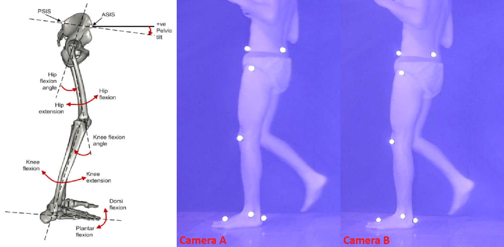

# 3D Marker Tracking and Analysis

## Overview
This project focuses on 3D marker tracking and analysis using MATLAB. It includes functions for extracting markers from images, sorting markers, labeling markers, calculating angles in three planes, and converting 3D points into dictionaries. The project also involves filtering RGB channels, and sending HTTP request.

## File Structure
- `StereoCameras3DReconstructionFromVideo.m`: Main MATLAB script containing marker tracking and analysis functions.
- `README.md`: Project overview and file structure.
- Other supporting functions and calculations within the script.

## Functions
- Marker extraction: `ExtractMarkersPosXY`
- Marker sorting: `AscendentSort_SumOfAxisValues`, `DescendSort_YAxisValues`
- Marker labeling: `LabelMarkers2DImages_7`, `LabelMarkers2DImages_9`
- 3D point conversion: `GetDicPoint3D`, `GetArrayDicPoints3D`
- Angle calculations: `GetJsonOfCalculatedAnglesInThreePlanes`, various angle calculation functions

## Usage
1. Run the script `StereoCameras3DReconstructionFromVideo.m`.
2. Call the desired functions for marker tracking, sorting, labeling, and angle calculations.
3. Ensure proper input data for accurate results.
4. Check the console for any output or errors.

## Dependencies
- MATLAB R2014b environment
- Image Processing Toolbox
- Statistics and Machine Learning Toolbox

## Contributors
- Kevin Martell Luya